# KosKu — Aplikasi Manajemen Kos & Kontrakan

Aplikasi web lengkap untuk mengelola kos: calon penghuni bisa melihat kamar dan
booking online sendiri, penghuni mengurus tagihan dan komplain dari dashboard,
dan pemilik kos memantau hunian serta keuangan dari satu tempat.

Dibuat dengan **Next.js 14 (App Router)**, **TypeScript**, **PostgreSQL + Prisma**,
dan **Tailwind CSS**. Seluruh antarmuka berbahasa Indonesia.

> **Baru pertama kali?** Ikuti [PANDUAN-INSTALL.md](PANDUAN-INSTALL.md) untuk
> menjalankan di komputer sendiri, lalu [PANDUAN-DEPLOY-VERCEL.md](PANDUAN-DEPLOY-VERCEL.md)
> untuk menaikkannya ke internet secara gratis.

---

## Daftar isi

- [Tampilan aplikasi](#tampilan-aplikasi)
- [Fitur](#fitur)
- [Akun demo](#akun-demo)
- [Cara install singkat](#cara-install-singkat)
- [Perintah yang tersedia](#perintah-yang-tersedia)
- [Struktur folder](#struktur-folder)
- [Mode QRIS demo](#mode-qris-demo)
- [Mengganti ke payment gateway asli](#mengganti-ke-payment-gateway-asli)
- [Tagihan otomatis & cron](#tagihan-otomatis--cron)
- [Penyimpanan berkas unggahan](#penyimpanan-berkas-unggahan)
- [Keamanan](#keamanan)

---

## Tampilan aplikasi

| Halaman depan | Daftar kamar |
| --- | --- |
| 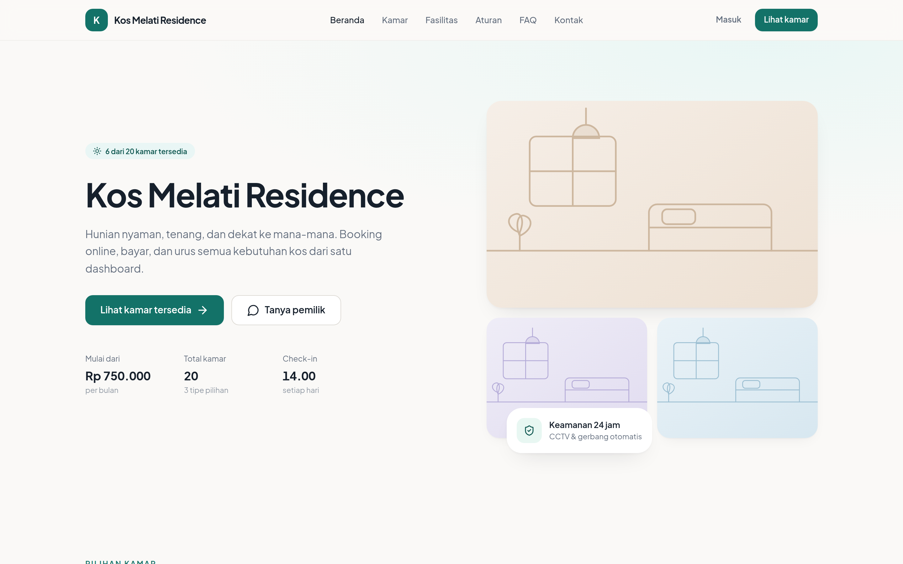 | 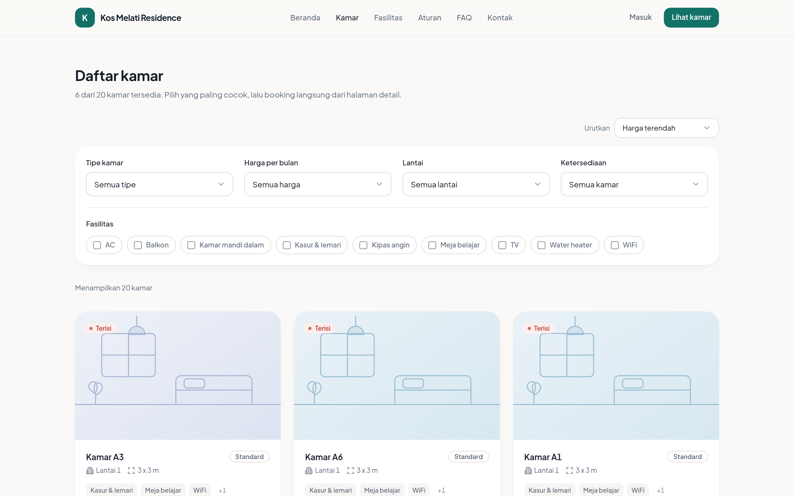 |

| Detail kamar | Form booking |
| --- | --- |
|  | 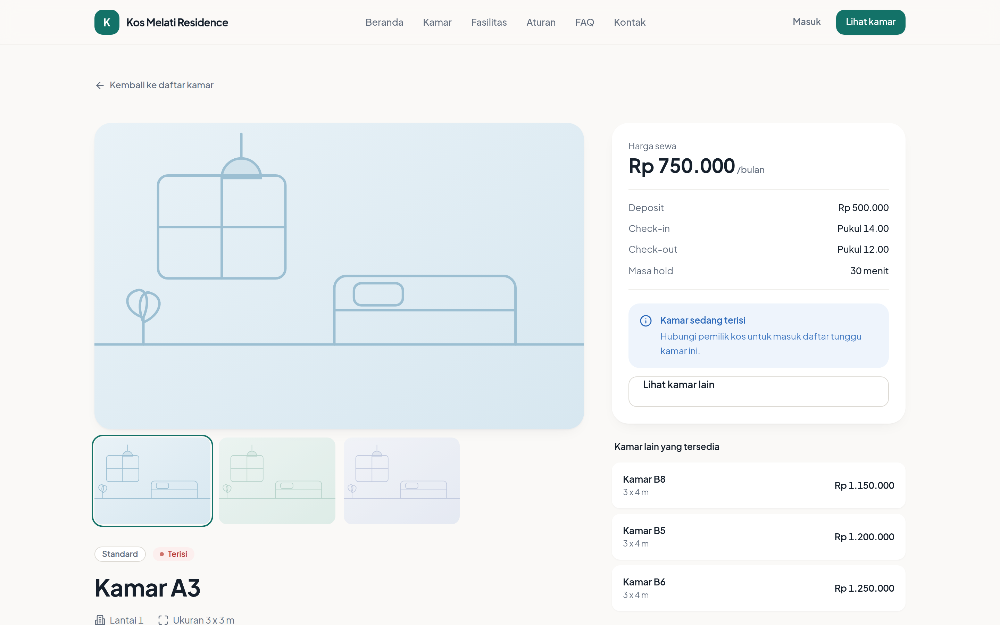 |

| Beranda penghuni | Bayar tagihan (QRIS demo) |
| --- | --- |
| 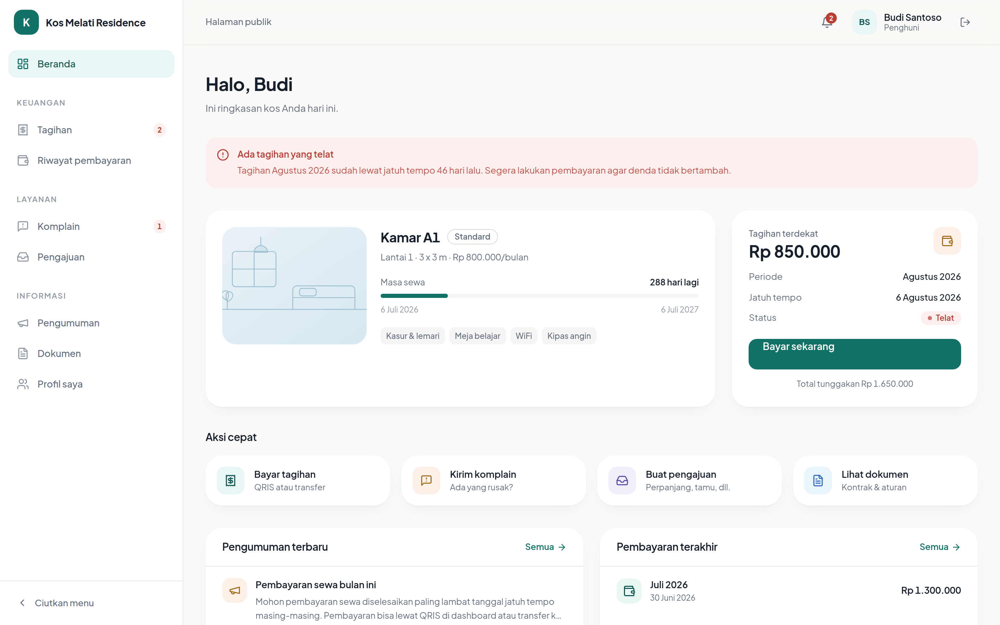 | 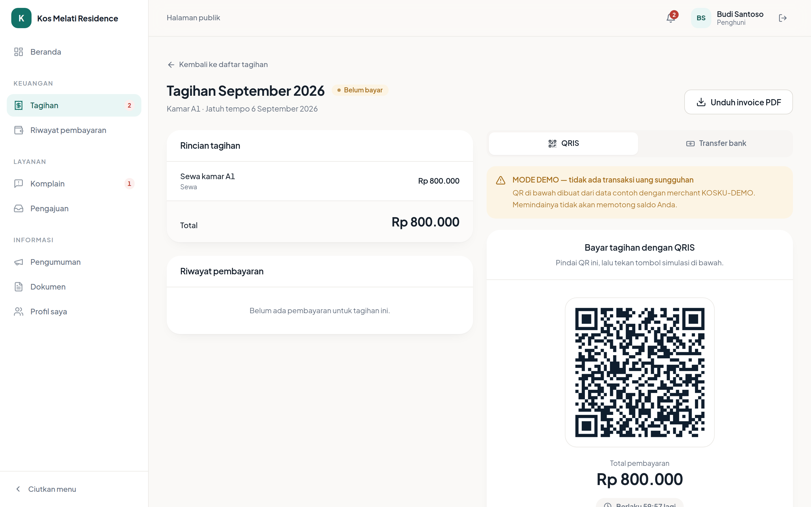 |

| Dashboard admin | Laporan keuangan |
| --- | --- |
| 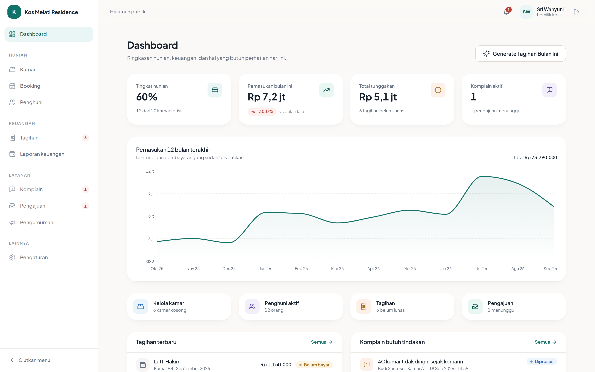 | 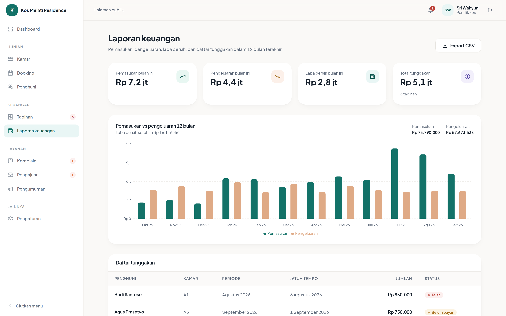 |

| Inbox komplain | Kelola kamar |
| --- | --- |
| 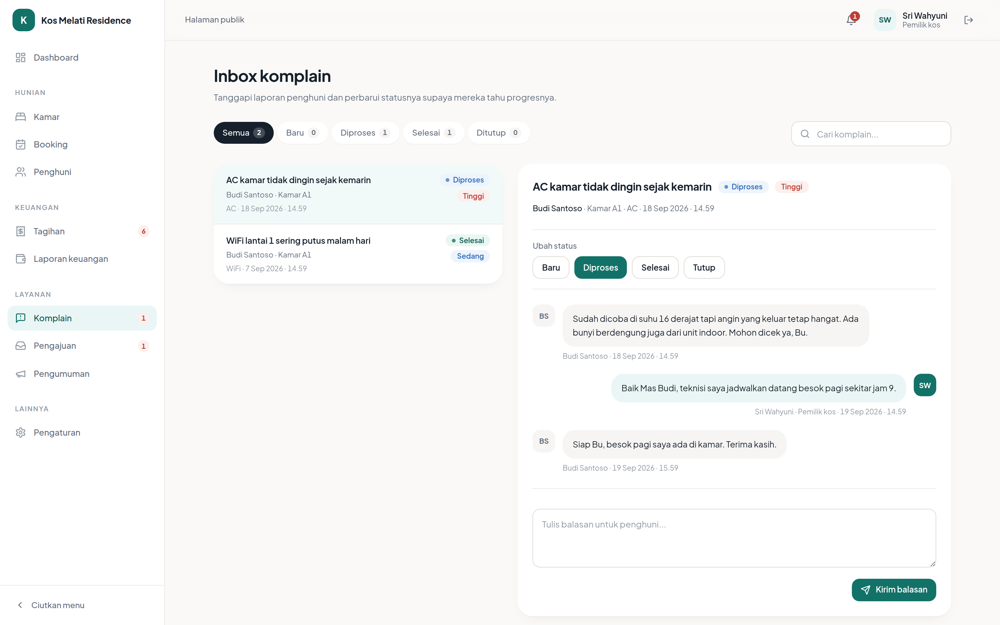 | 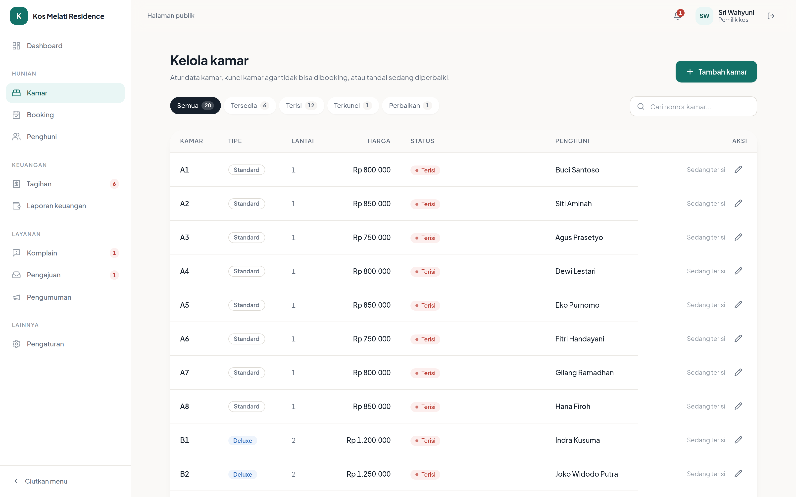 |

| Tampilan HP — depan | Tampilan HP — penghuni |
| --- | --- |
| 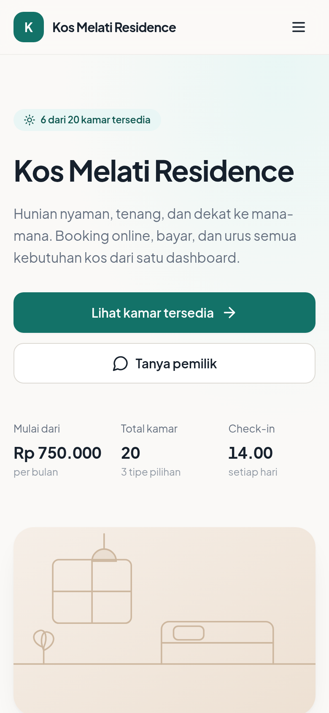 | 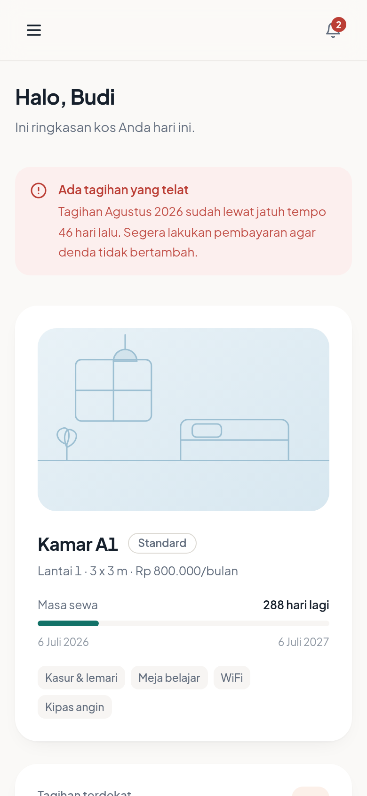 |

Semua tangkapan layar di atas diambil dari aplikasi yang benar-benar berjalan
dengan data contoh dari `prisma/seed.ts`. Seluruh 21 tangkapan layar ada di
[`docs/screenshots/`](docs/screenshots).

---

## Fitur

### Halaman publik (tanpa login)

| Route | Isi |
| --- | --- |
| `/kosku` | Hero, counter "X dari Y kamar tersedia", kamar pilihan, fasilitas, galeri, lokasi, aturan kos, FAQ, kontak |
| `/kosku/rooms` | Daftar kamar + filter tipe, harga, lantai, fasilitas, ketersediaan + pengurutan |
| `/kosku/rooms/[id]` | Galeri foto, fasilitas, ukuran, harga, tombol **Booking Sekarang** |
| `/kosku/book/[roomId]` | Pilih tanggal masuk & durasi (1/3/6/12 bulan), rincian biaya langsung terhitung |
| `/kosku/register` | Daftar akun: username, password, nama, HP, email, upload KTP, kontak darurat |
| `/kosku/login` | Masuk dengan username + password |
| `/kosku/payment/[bookingId]` | Pembayaran QRIS demo + hitung mundur masa hold |

### Dashboard penghuni (`TENANT`)

- **Beranda** — kartu kamar, sisa masa sewa, tagihan terdekat, pengumuman, aksi cepat
- **Tagihan** — daftar + filter status, detail, bayar QRIS demo atau unggah bukti transfer, unduh invoice PDF
- **Riwayat pembayaran** — semua pembayaran + unduh kwitansi PDF
- **Komplain** — buat komplain (kategori, prioritas, foto) dan thread balasan dengan admin
- **Pengajuan** — perpanjang sewa, pindah kamar, check-out, izin tamu menginap, layanan tambahan
- **Pengumuman**, **Dokumen** (kontrak sewa PDF + aturan kos), **Profil** (edit data, ganti password)

### Dashboard admin (`ADMIN`)

- **Dashboard** — tingkat hunian, pemasukan bulan ini vs bulan lalu, total tunggakan, komplain aktif, grafik pemasukan 12 bulan, aktivitas terbaru
- **Kamar** — tabel kamar, tambah/edit, kelola foto, tombol **Kunci/Buka Kunci**, tandai perbaikan, riwayat penghuni
- **Booking** — booking masuk lengkap dengan data KTP calon penghuni
- **Penghuni** — penghuni aktif & riwayat penghuni lama, detail, proses check-out, pengembalian deposit
- **Tagihan** — semua tagihan, **Generate Tagihan Bulan Ini**, tambah biaya tambahan, catat bayar tunai, verifikasi bukti transfer
- **Komplain** — inbox, ubah status, balas
- **Pengajuan** — approve/tolak (perpanjangan & pindah kamar langsung diterapkan ke data)
- **Pengumuman** — buat & kelola, otomatis mengirim notifikasi ke semua penghuni
- **Laporan keuangan** — pemasukan vs pengeluaran, laba bersih, daftar tunggakan, catat pengeluaran, **export CSV**
- **Pengaturan** — info kos, rekening, tanggal jatuh tempo, nominal denda, deposit, durasi hold booking, aturan kos

### Alur booking otomatis (tanpa persetujuan admin)

1. Tamu memilih kamar berstatus **Tersedia**
2. Isi tanggal masuk + durasi → rincian biaya (sewa × durasi + deposit)
3. Daftar akun (atau masuk kalau sudah punya)
4. Booking dibuat berstatus `PENDING`, kamar **dikunci 30 menit** (`holdUntil`)
5. Diarahkan ke halaman QRIS demo
6. Setelah pembayaran berhasil, semuanya berjalan otomatis dalam satu transaksi:
   `Booking → PAID`, `Room → OCCUPIED`, `Tenancy` dibuat `ACTIVE`, `User.role → TENANT`,
   tagihan dibuat berstatus lunas, `Payment` tercatat `VERIFIED`, notifikasi dikirim
   ke penghuni dan admin, lalu diarahkan ke `/kosku/tenant`
7. Kalau masa hold lewat tanpa pembayaran, booking jadi `EXPIRED` dan kamar kembali
   tersedia — dicek lewat `/api/cron/expire-bookings` **dan** setiap kali daftar
   kamar dibuka

---

## Akun demo

Setelah menjalankan `npm run db:seed`:

| Peran | Username | Password |
| --- | --- | --- |
| Pemilik kos (admin) | `admin` | `admin123` |
| Penghuni | `budi` | `budi123` |
| Penghuni lainnya | `sitiaminah`, `agusprasetyo`, `dewilestari`, … | `penghuni123` |

Data contoh yang ikut dibuat: 20 kamar (12 terisi, 6 tersedia, 1 terkunci,
1 perbaikan), 3 pengumuman, tagihan & pembayaran 12 bulan ke belakang untuk
grafik, beberapa pengeluaran, komplain, dan pengajuan.

Akun `budi` sengaja dibuat punya tepat 3 tagihan: **1 lunas, 1 telat, 1 belum bayar**.

> ⚠️ Ganti password akun `admin` sebelum dipakai sungguhan.

---

## Cara install singkat

Untuk panduan super detail (termasuk cara install Node.js dan PostgreSQL),
buka **[PANDUAN-INSTALL.md](PANDUAN-INSTALL.md)**.

```bash
# 1. Install dependensi
npm install

# 2. Siapkan konfigurasi
cp .env.example .env        # Windows: copy .env.example .env
#    lalu isi DATABASE_URL dan SESSION_SECRET di dalam file .env

# 3. Buat tabel di database
npm run db:push

# 4. Isi data contoh
npm run db:seed

# 5. Jalankan
npm run dev
```

Buka <http://localhost:3000/kosku>.

**Syarat:** Node.js 20 ke atas dan sebuah database PostgreSQL (lokal atau gratisan
seperti Neon/Supabase).

---

## Perintah yang tersedia

| Perintah | Kegunaan |
| --- | --- |
| `npm run dev` | Menjalankan mode pengembangan di port 3000 |
| `npm run build` | Build untuk produksi |
| `npm run start` | Menjalankan hasil build |
| `npm run db:push` | Membuat/menyamakan tabel di database dengan `schema.prisma` |
| `npm run db:seed` | Mengisi data contoh (menghapus data lama lebih dulu) |
| `npm run db:studio` | Membuka Prisma Studio untuk melihat isi database |
| `npm run format` | Merapikan format kode dengan Prettier |

---

## Struktur folder

```
kosku/
├── app/
│   ├── api/
│   │   ├── cron/expire-bookings/     # membatalkan booking kedaluwarsa
│   │   ├── cron/generate-bills/      # menerbitkan tagihan bulanan + denda
│   │   ├── documents/                # invoice, kwitansi, kontrak (PDF)
│   │   ├── files/[id]/               # penyaji berkas unggahan dari database
│   │   ├── payments/qris/callback/   # webhook pembayaran
│   │   └── reports/finance/          # export CSV laporan keuangan
│   ├── kosku/
│   │   ├── (public)/                 # landing, kamar, booking, login, daftar, bayar
│   │   ├── admin/                    # 14 halaman dashboard pemilik kos
│   │   └── tenant/                   # 12 halaman dashboard penghuni
│   ├── globals.css                   # design token (warna, radius, bayangan)
│   └── layout.tsx
├── components/
│   ├── admin/  dashboard/  public/  tenant/  payment/
│   └── ui/                           # komponen dasar: Button, Card, Field, Table, …
├── lib/
│   ├── actions/                      # server action (semua perubahan data)
│   ├── payment/provider.ts           # abstraksi pembayaran (DemoQrisProvider)
│   ├── pdf/documents.tsx             # template PDF
│   ├── auth.ts  token.ts             # session cookie httpOnly + bcrypt
│   ├── billing.ts  bookings.ts       # aturan tagihan & booking
│   ├── validations.ts                # seluruh skema Zod
│   └── db.ts  format.ts  settings.ts  storage.ts  stats.ts
├── prisma/
│   ├── schema.prisma
│   └── seed.ts
├── docs/screenshots/
├── middleware.ts                     # gerbang route ADMIN / TENANT
└── vercel.json                       # jadwal cron di Vercel
```

---

## Mode QRIS demo

**Aplikasi ini tidak memproses uang sungguhan.**

- QR dibuat dari payload contoh bermerchant `KOSKU-DEMO`, memakai struktur
  mirip QRIS asli (format EMVCo + checksum CRC16) supaya tetap terbaca rapi
  oleh pemindai, tetapi tidak terhubung ke bank mana pun.
- Di setiap halaman pembayaran ada banner **"MODE DEMO — tidak ada transaksi
  uang sungguhan"**.
- Tombol **"Simulasikan Pembayaran Berhasil"** memanggil endpoint webhook yang
  bentuknya sama persis dengan gateway sungguhan:

  ```http
  POST /api/payments/qris/callback
  Content-Type: application/json

  { "qrisRef": "BOOK-XXXX-YYYY", "status": "PAID", "amount": 3500000 }
  ```

  Endpoint ini memverifikasi payload lewat `PaymentProvider.verifyCallback()`,
  mencocokkan referensi dan nominal ke tabel `Payment`, lalu memperbarui status.

---

## Mengganti ke payment gateway asli

Seluruh logika pembayaran diisolasi di satu berkas: **`lib/payment/provider.ts`**.

```ts
export interface PaymentProvider {
  readonly name: string;
  readonly isDemo: boolean;
  createCharge(input: CreateChargeInput): Promise<Charge>;
  verifyCallback(input: CallbackInput): Promise<CallbackResult>;
}
```

Langkah pindah ke Midtrans (atau Xendit, Duitku, dan sejenisnya):

1. Buat berkas baru, misalnya `lib/payment/midtrans.ts`:

   ```ts
   export class MidtransProvider implements PaymentProvider {
     readonly name = 'MIDTRANS';
     readonly isDemo = false;

     async createCharge(input: CreateChargeInput): Promise<Charge> {
       // panggil API Midtrans /v2/charge dengan payment_type: 'qris'
       // kembalikan { reference, amount, payload, qrImageDataUrl, expiresAt, isDemo: false }
     }

     async verifyCallback(input: CallbackInput): Promise<CallbackResult> {
       // verifikasi signature_key = sha512(order_id + status_code + gross_amount + server_key)
       // kembalikan { reference, amount, paid }
     }
   }
   ```

2. Ganti satu baris di bagian bawah `lib/payment/provider.ts`:

   ```diff
   - cached = new DemoQrisProvider();
   + cached = new MidtransProvider(process.env.MIDTRANS_SERVER_KEY!);
   ```

3. Arahkan URL webhook di dashboard gateway ke
   `https://domain-anda.com/api/payments/qris/callback`.

4. Hapus tombol simulasi dan banner demo di `components/payment/qris-panel.tsx`.

Tidak ada kode lain yang perlu diubah — halaman, server action, dan database
semuanya hanya berbicara lewat interface di atas.

---

## Tagihan otomatis & cron

| Endpoint | Fungsi |
| --- | --- |
| `GET/POST /api/cron/generate-bills` | Menerbitkan tagihan bulan berjalan untuk semua sewa aktif, lalu menandai tagihan lewat jatuh tempo menjadi `OVERDUE` dan menambahkan denda |
| `GET/POST /api/cron/expire-bookings` | Membatalkan booking yang masa hold-nya habis dan mengembalikan kamar |

Keduanya bisa dipanggil dengan salah satu cara:

- **Header rahasia** — `Authorization: Bearer <CRON_SECRET>` (dipakai Vercel Cron otomatis)
- **Admin yang sedang login** — tombol **Generate Tagihan Bulan Ini** di dashboard admin

Aturan tagihan (bisa diubah di menu **Pengaturan**):

- Siklus per bulan
- Jatuh tempo default mengikuti tanggal check-in tiap penghuni, atau tanggal tetap
- Denda keterlambatan berupa nominal tetap atau persen dari tagihan, ditambahkan sekali
- Penghuni bisa bayar via QRIS demo (langsung lunas) atau unggah bukti transfer
  (status `WAITING_VERIFICATION` sampai admin memverifikasi)

---

## Penyimpanan berkas unggahan

Foto KTP, foto komplain, foto kamar, dan bukti transfer disimpan ke
**`/public/uploads`** saat dijalankan di komputer sendiri.

Hosting seperti Vercel punya filesystem yang tidak bisa ditulis. Karena itu
`lib/storage.ts` otomatis beralih menyimpan berkas ke database (tabel `FileBlob`)
dan menyajikannya lewat `/api/files/[id]`. Tidak ada yang perlu diatur — tetapi
bisa dipaksa lewat environment variable:

```env
FILE_STORAGE=local      # selalu ke /public/uploads
FILE_STORAGE=database   # selalu ke database
```

Batas unggahan: gambar JPG/PNG/WEBP/GIF, maksimal 5 MB per berkas.

---

## Keamanan

- Password di-hash dengan **bcrypt** (10 putaran)
- Session disimpan sebagai baris di tabel `Session` + cookie **httpOnly**,
  `sameSite=lax`, `secure` saat produksi, ditandatangani HMAC-SHA256
- `middleware.ts` menjaga route: `/kosku/admin/*` hanya `ADMIN`,
  `/kosku/tenant/*` hanya `TENANT`
- Pemeriksaan kepemilikan data dilakukan **di server** pada setiap server action
  dan API route, bukan hanya disembunyikan di tampilan
- Semua input divalidasi dengan **Zod** di sisi server
- Unggahan dibatasi tipe dan ukurannya
- Ganti password otomatis mencabut seluruh session lama

---

## Catatan teknis

- Prisma dijalankan dengan **driver adapter** (`@prisma/adapter-pg` + preview
  `queryCompiler`). Efeknya: tidak ada binary Rust yang perlu diunduh saat runtime,
  sehingga cold start di Vercel lebih ringan.
- Huruf **Plus Jakarta Sans** di-host sendiri lewat paket npm `@fontsource-variable`,
  jadi aplikasi tidak memanggil Google Fonts saat dibuka.
- Mata uang diformat dengan `Intl.NumberFormat('id-ID')`, tanggal memakai
  format Indonesia buatan sendiri di `lib/format.ts`.
- Komponen antarmuka ditulis tangan mengikuti pola shadcn/ui
  (`class-variance-authority` + `tailwind-merge` + `forwardRef`) sehingga tidak
  ada dependensi UI tambahan yang perlu dipasang.
- Form dikirim lewat **server action**, jadi tetap berfungsi walau JavaScript
  dimatikan. React Hook Form + Zod dipakai untuk pesan kesalahan langsung di
  form pendaftaran dan ganti password, memakai skema yang sama dengan
  pemeriksaan di server.
- Kode TypeScript `strict`, tanpa `any`.

## Lisensi

Bebas dipakai dan dimodifikasi untuk keperluan pribadi maupun komersial.
